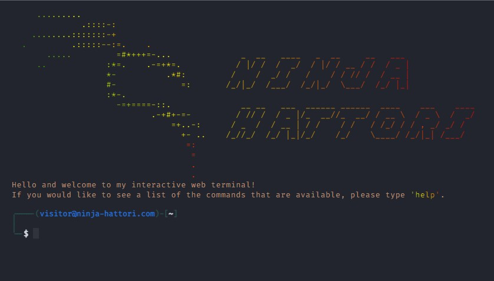

# Terminal Porfolio Website by ninja-hattori

My portfolio website in terminal version developed just with HTML, CSS and JavaScript. Keyboard shortcuts can be used for some functionalities.

## Features

- Autocomplete feature ✨ (TAB)
- Go previous and next command (ctrl+p/⬆️|⬇️)
- View command history 📖

## Inspiration and Credits

Here are some inspiration for this kind of terminal website.

- [term m4tt72](https://term.m4tt72.com/)
- [Fkcode](https://fkcodes.com/)
- [satnaing](https://terminal.satnaing.dev/)
- [aterm](https://aterm.netlify.app/)
